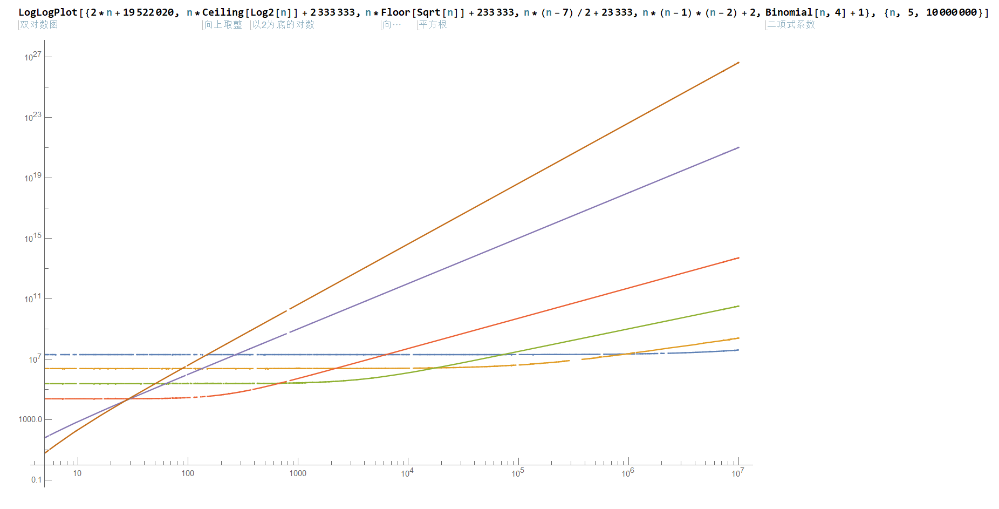

# A - 士谔 2073

|                   考点                   | 难度  |
| :--------------------------------------: | :---: |
| 循环、判断、数组标记、分离整数的各个位数 |   2   |

## 题目说明

本题考查了大家对数字的各个位数进行分离，同时考察了循环语句、判断语句，以及用数组标记某数字是否出现过，虽然难度不大，但是考查点比较综合。

## 样例程序

```c++
#include <stdio.h>

int flag[50000]; //标记数组，如果某数字x出现过，则令flag[x] = 1；

int main()
{
	int L, R, n;
	int i, num, cnt, x;

	scanf("%d", &n);
	while (n--)
	{
		scanf("%d%d", &L, &R);
		for (i = L; i <= R; i++)
		{
			num = i;
			cnt = 0;
			while (num != 0)
			{
				x = num % 10;
				num /= 10;
				if (x == 2 || x == 0 || x == 7 || x == 3)
				{
					cnt++;
				}
			}
			if (cnt == 2 || cnt == 0 || cnt == 7 || cnt == 3)
			{
				if (flag[i] == 0)
				{
					printf("%d ", i);
					flag[i] = 1;
				}
			}
		}
		printf("\n");
	}
	
	return 0;
}
```

<div style="page-break-after: always;"></div>

# B - 入场式

| 难度  |    考点    |
| :---: | :--------: |
|   2   | 循环，思维 |

## 题目分析

这是一道不太复杂的简单思维题。

我们证明：如果将同一水平位置身高较低的调整至第一列，身高较高的调整至第二列，如果这样不可以将两列队伍变成优美的，那么别的方法也不可以。

记第一列第 $i$ 位置同学身高为 $a_i$，第二列第 $i$ 位置同学身高为 $b_i$。如果使用这种方法后不能将队伍变成优美的，则不妨设存在有最小的 $i,i\ge 2,a_i \le a_{i-1}$，则将 $a_i,b_i$ 对调后有 $b_{i-1} \ge a_{i-1} \ge a_i$，即第二列变得不再优美，将$a_{i-1},b_{i-1}$ 对调同样不行。若 $i$ 使得 $b_i \le b_{i-1}$也同理可证。故只要判断使用这种方法能否调整成功即可。

具体代码实现为通过循环将将同一位置身高较低的调整至第一列，身高较高的调整至第二列。再判断这两列是否优美。注意判断是否优美的条件是**严格单调递增**，即后一个人身高严格大于前一个人身高。

## 示例程序

```c++
#include <stdio.h>

int a[100100], b[100100];

int main()
{
	int n;
	int i;

	scanf("%d", &n);
	for (i = 1; i <= n; i++)
		scanf("%d", &a[i]);
	for (i = 1; i <= n; i++)
		scanf("%d", &b[i]);
	for (i = 1; i <= n; i++)
	{
		int tmin = a[i] < b[i] ? a[i] : b[i];
		int tmax = a[i] > b[i] ? a[i] : b[i];
		a[i] = tmin;
		b[i] = tmax;
	}

	for (i = 2; i <= n; i++)
	{
		if (a[i] <= a[i - 1] || b[i] <= b[i - 1])
		{
			printf("no\n");
			return 0;
		}
	}
	printf("yes\n");

	return 0;
}
```

<div style="page-break-after: always;"></div>

# C - 饿饿，饭饭

| 难度  |    考点    |
| :---: | :--------: |
|   3   | 循环，贪心 |

## 题目分析

我们从第一个小时开始遍历，用一个 `maxi` 变量记录汪吉目前最久能撑到第几个小时，即 `1 ~ maxi` 之间所有的饭汪吉都可以吃到。那么每次我们可以用 $\textit{maxi} = \min \{ \max \{\textit{maxi},\  i + a[i] \},\ n \}$ 来更新时间即可（里面的 `max` 用来更新数据，外面的 `min` 表示最长的时间不应该超过题目给出的 `n`）。如果汪吉能撑的时间大于等于 `n` ，那么说明汪吉可以做完作业。

注意如果第一个小时汪吉吃不到饭，那么一定无法做完作业。

P.s. 一开始出的题目是问“汪吉最少吃几顿饭才能做完作业”，后来简化成了这道题，学有余力的同学可以想想原题怎么做。:)

## 示例程序

```c++
#include <stdio.h>

#define N 500
#define max(a, b) ((a) > (b) ? (a) : (b))
#define min(a, b) ((a) < (b) ? (a) : (b))

int T, n;
int a[N + 5];

int main()
{
	scanf("%d", &T);
	int i, j, maxi;

	while (T--)
	{
		scanf("%d", &n);

		maxi = 0; // maxi 表示最远能到达哪里
		for (i = 1; i <= n; ++i) scanf("%d", &a[i]);

		if (!a[1])
		{ // 第一次汪吉吃不到饭
			printf("You lose!\n");
			continue;
		}

		for (i = maxi = 1; i <= maxi && maxi != n; ++i) maxi = min(max(i + a[i], maxi), n);

		printf(maxi == n ? "Completed!\n" : "You lose!\n");
	}

	return 0;
}
```

<div style="page-break-after: always;"></div>

# D - 找规律

| 难度 | 考点      |
| ---- | --------- |
| 3    | 循环，gcd |

## 题目分析

1. 示例代码 1 的思路：按照题目所给的排列顺序依次口算得到数字，并总结计算规律：（以第 1 个数 1/1 为起点）
   1. 向右走一步，分子不变，分母增加 1，得到 1/2；
   2. 然后向左下方走，每走一步，分子增加 1，分母减少 1 ，直至到达“边界”——最左列分母为 1 ，得到 2/1；
   3. 然后向下走一步，分子增加 1 ，分母不变，得到 3/1；
   4. 然后向右上方走，每走一步，分子减小 1 ，分母不变，直至到达“边界”——第一行分子为 1 ，得到 1/3；
   5. 然后可以再以第 6 个数 1/3 为起点，重复 “向右一步 — 向左下方直至分母为 1 — 向下一步 — 向右上方直至分子为 1 ” 的路线。
   6. 用 `int` 型变量 `a` 表示分子， `b` 表示分母，`flag` 表示数数的方向，模拟上述路线。详见“示例代码 1”。
   
2. 示例代码 2 （更快）的思路：发现表中从左上角开始数，第 k 个斜行有 k 个数字，每个斜行内部的数字的分子和分母有数值上的规律：
   
   1. 设第 n 个数字在第 k 斜行，用变量 `s` 表示从第 1 斜行到第 k 斜行共有多少个数字 （$s=\sum_{i=1}^{k}{i}=1+2+···+k$），则 k 满足 $\sum_{i=1}^{k}{i} \ge n$ 并且 $\sum_{i=1}^{k-1}i<n$ ，即 k 是使得 $s \ge n$ 的最小整数。
   2. 在第 k 斜行，从右上往左下数，第 i 个数是 `i / (k - i + 1)` ，从左下往右上数，第 i 个数是 `(k - i + 1) / i` 。注意在“示例代码 2” 中，用 `s - n` 表示 `i` 。
   3. k 为奇数时，这一斜行是从左下往右上数；k 为偶数时，这一斜行时从右上往左下数。
   
3. 分数的最简形式：
   1. 分子分母同除以两者的最大公约数。
   2. 特判分母为 1 的情况。

4. 示例代码中都有用二进制位运算简化代码的语句，如：改变一个变量的逻辑真值（而不需知道它原本的值） `flag ^= 1` ；判断奇偶（括号中条件若成立，则 k 为奇数） `if ( k & 1 )` 。

5. 易错点：
   - 多组数据的题目，**不需要**最后一次性输出所有组数据的答案。但是要注意每组输出之间**有分隔**，多数情况是换行，比如在答案之后输出一个 '\n' ，否则将喜提格式错误 **Presentation Error**。

   - 求累加和，存储**和**的变量需要赋初值 **0** ；求累乘积，存储**积**的变量需要赋初值 **1** 。
   - 求最大公约数时，注意不要让程序执行 “除数为 0 的计算”。
   - 看到有些代码用到了 “用异或运算不借助第三个变量交换两个变量的值” ，写法类似于“ `a ^= b; b ^= a; a ^= b;`  ”， 这样写的同学注意 `a == b` 时不能用这种方式进行交换。（原因自己考虑）

## 示例代码 1

```c++
#include <stdio.h>

int main()
{
	int n, a, b, A, B, r, i, flag; //0:↗ 1: ↙
	
	while (scanf("%d", &n) != EOF)
	{
		a = 1;
		b = 1;
		flag = 0;
		for (i = 1; i < n; i++)
		{ //模拟分子和分母各自的变化
			if (a == 1)
			{ //分子为 1 ，现在数到了第一行
				if (!flag)
				{
					b++;
					flag ^= 1;
				} // → ，flag 为 0 表示刚到第一行，现在需要向右走，并且把 flag 从 0 变成 1 ，表示已经走过向右的一步了
				else
				{
					a++;
					b--;
				} // ↙ ，flag 为 1 表示走完向右的一步了，现在需要向左下方走
			}
			else if (b == 1)
			{ //分母为 1 ，现在数到了最左列
				if (flag)
				{
					a++;
					flag ^= 1;
				} // ↓ ，flag 为 1 表示刚到最左列，现在需要向下走，并且把 flag 从 1 变成 0 ，表示已经走过向下的一步了
				else
				{
					a--;
					b++;
				} // ↗ ，flag 为 0 表示走完向下的一步了，现在需要向右上方走
			}
			else
			{ //分子和分母都不为 1 ，说明不再第一行或最左列。
				if (!flag)
				{
					a--;
					b++;
				} //↗ ， flag 为 0 表示现在正在向右上方走
				else
				{
					a++;
					b--;
				} // ↙ ， flag 为 1 表示现在正在向左下方走
			}
		}
		// 求最大公约数（gcd）
		A = a;
		B = b;
		do
		{
			r = A % B;
			A = B;
			B = r;
		} while (r != 0);
		// 输出答案
		a /= A;
		b /= A;
		if (b == 1)
			printf("%d\n", a);
		else
			printf("%d / %d\n", a, b);
	}
	
	return 0;
}
```

## 示例代码 2

```c++
#include <stdio.h>

int main()
{
	int n, a, b, A, B, r, k, s;

	while (scanf("%d", &n) != EOF)
	{
		k = 0; //记录第几斜行
		s = 0; //记录累加和
		while (s < n)
		{
			k++;
			s += k;
		}
		if (k & 1)
		{                  // 根据按位与 & 的运算性质，当 k 为奇数时， k & 1 == 1 。 ↗
			a = s - n + 1; // s - n 表示在第 k 行的第几个，相当于题目分析 2 中的 i
			b = k + n - s;
		}
		else
		{ // k & 1 == 0 时 k 为偶数。 ↙
			a = k + n - s;
			b = s - n + 1;
		}
		// 求最大公约数（gcd）
		A = a;
		B = b;
		while (B)
		{
			r = A % B;
			A = B;
			B = r;
		}
		// 输出答案
		a /= A;
		b /= A;
		if (b == 1)
			printf("%d\n", a);
		else
			printf("%d / %d\n", a, b);
	}

	return 0;
}
```

<div style="page-break-after: always;"></div>

# E - 猪脚替猪脚查猪脚

|               考点                | 难度  |
| :-------------------------------: | :---: |
| 循环、break，continue控制流的运用 |   3   |

## 题目说明

本题简单的考察了循环的应用，根据题目描述处理数据即可，请注意题目中明确的对 break 使用的暗示。

## 样例程序

```c++
#include <stdio.h>

int a[105][105];

int main()
{

	int m, n;
	double standard;
	int i, j;
	int ds = 0;                            //用来统计一批内合格个数
	int dl = 0, dl1 = 0, dl2 = 0, dl3 = 0; //用来统计不合格流水线个数,以及各种情况不合格的流水线数
	int flag = 0;                          //用来标记有没有夹生或者加糖，防止重复统计

	scanf("%d%d", &m, &n);
	scanf("%lf", &standard);

	for (i = 1; i <= m; i++)
		for (j = 1; j <= n; j++)
			scanf("%d", &a[i][j]);
	for (i = 1; i <= m; i++)
	{
		ds = 0; //初始化合格个数
		flag = 0;
		for (j = 1; j <= n; j++)
		{
			if (a[i][j] == 0)
			{
				ds++;
				continue;
			}
			else if (a[i][j] == 1)
			{
				continue;
			}
			else if (a[i][j] == 2) //加成糖了，这条流水线再见
			{
				dl++;
				dl2++;
				flag = 1;
				break;
			}
			else if (a[i][j] == 3) //夹生了，这条流水线再见
			{
				dl++;
				dl3++;
				flag = 1;
				break;
			}
		}
		if (flag == 0) //统计生产线合格率
		{
			if (((double)ds / n) < standard) //合格率不达标
			{
				dl++;
				dl1++;
			}
		}
	}

	if (((double)(m - dl) / m) < standard) //总体不合格
	{
		if (dl1 > dl2 && dl1 > dl3)
			printf("bad assembly lines !");
		else if (dl2 > dl1 && dl2 > dl3)
			printf("terribly sweet !");
		else
			printf("your zhujiao are still raw !");
	}
	else
	{
		printf("your factory has produced nice zhujiao !");
	}

	return 0;
}
```

<div style="page-break-after: always;"></div>

# F - HTTP Status Code
| 难度 | 考点               |
| ---- | ------------------ |
| 3    | `switch-case` 语句 |

## 题目分析

通过本题让同学们了解 `switch-case` 语句的用法，并尝试使用 `switch-case` 语句和 `break` 语句的配合。需要注意的是，同学们自行搜索的互联网上的内容，可能由于未及时更新与题目 Hint 给出的 HTTP Status Code 不一致，希望同学们能明白提示的重要性。

**以后记得看提示。**

## 示例代码

```c++
#include <stdio.h>

int main()
{
	int a;
	
	while (scanf("%d", &a) != EOF)
	{
		switch (a)
		{
			case 100: printf("Continue\n"); break;
			case 101: printf("Switching Protocols\n"); break;
			case 200: printf("OK\n"); break;
			case 201: printf("Created\n"); break;
			case 202: printf("Accepted\n"); break;
			case 203: printf("Non-Authoritative Information\n"); break;
			case 204: printf("No Content\n"); break;
			case 205: printf("Reset Content\n"); break;
			case 206: printf("Partial Content\n"); break;
			case 300: printf("Multiple Choices\n"); break;
			case 301: printf("Moved Permanently\n"); break;
			case 302: printf("Found\n"); break;
			case 303: printf("See Other\n"); break;
			case 304: printf("Not Modified\n"); break;
			case 305: printf("Use Proxy\n"); break;
			case 306: printf("Switch Proxy\n"); break;
			case 307: printf("Temporary Redirect\n"); break;
			case 308: printf("Permanent Redirect\n"); break;
			case 400: printf("Bad Request\n"); break;
			case 401: printf("Unauthorized\n"); break;
			case 402: printf("Payment Required\n"); break;
			case 403: printf("Forbidden\n"); break;
			case 404: printf("Not Found\n"); break;
			case 405: printf("Method Not Allowed\n"); break;
			case 406: printf("Not Acceptable\n"); break;
			case 407: printf("Proxy Authentication Required\n"); break;
			case 408: printf("Request Timeout\n"); break;
			case 409: printf("Conflict\n"); break;
			case 410: printf("Gone\n"); break;
			case 411: printf("Length Required\n"); break;
			case 412: printf("Precondition Failed\n"); break;
			case 413: printf("Payload Too Large\n"); break;
			case 414: printf("URI Too Long\n"); break;
			case 415: printf("Unsupported Media Type\n"); break;
			case 416: printf("Range Not Satisfiable\n"); break;
			case 417: printf("Expectation Failed\n"); break;
			case 426: printf("Upgrade Required\n"); break;
			case 428: printf("Precondition Required\n"); break;
			case 429: printf("Too Many Requests\n"); break;
			case 431: printf("Request Header Fields Too Large\n"); break;
			case 451: printf("Unavailable For Legal Reasons\n"); break;
			case 500: printf("Internal Server Error\n"); break;
			case 501: printf("Not Implemented\n"); break;
			case 502: printf("Bad Gateway\n"); break;
			case 503: printf("Service Unavailable\n"); break;
			case 504: printf("Gateway Timeout\n"); break;
			case 505: printf("HTTP Version Not Supported\n"); break;
			case 511: printf("Network Authentication Required\n"); break;
		}
	}
	
	return 0;
}
```

<div style="page-break-after: always;"></div>

# G - 矩形

| 难度 | 考点           |
| ---- | -------------- |
| 3    | 循环与简单比较 |

## 题目分析

由于题目中给定条件 “保证每个矩形都有两条不相邻的边和 $x$ 轴相平行“，所以每个矩形包含的范围是由 
$$
x=\min(x_1,x_2,x_3,x_4)\\
x=\max(x_1,x_2,x_3,x_4)\\
y=\min(y_1,y_2,y_3,y_4)\\
y=\max(y_1,y_2,y_3,y_4)
$$
四条直线所组成。其中矩形的四个顶点坐标为 $(x_1,y_1),(x_2,y_2),(x_3,y_3),(x_4,y_4)$ 。

因此对于每个点 $(x,y)$ ，如果满足：
$$
\min(x1,x2,x3,x4)\leq x\leq \max(x1,x2,x3,x4)\\
\min(y1,y2,y3,y4)\leq y \leq \max(y1,y2,y3,y4)
$$
则说明这个点位于该矩形内，由此即可求出每个矩形所包含的点的个数。

## 示例程序

```c++
#include <stdio.h>

int main()
{
	int n, m;
	int top[60], bottom[60], left[60], right[60], count[60];
	int px[10], py[10];
	int i, j;
	int x, y;

	scanf("%d%d", &n, &m);
	for (i = 0; i < n; i++)
	{
		for (j = 0; j < 4; j++)
		{
			scanf("%d%d", &px[j], &py[j]);
		}

		top[i] = py[1];
		bottom[i] = py[1];
		left[i] = px[1];
		right[i] = px[1];

		for (j = 1; j < 4; j++)
		{
			if (py[j] > top[i])
			{
				top[i] = py[j];
			}
			if (py[j] < bottom[i])
			{
				bottom[i] = py[j];
			}
			if (px[j] < left[i])
			{
				left[i] = px[j];
			}
			if (px[j] > right[i])
			{
				right[i] = px[j];
			}
		}
	}

	for (i = 0; i < m; i++)
	{
		scanf("%d%d", &x, &y);
		for (j = 0; j < n; j++)
		{
			if (top[j] >= y && bottom[j] <= y)
			{
				if (right[j] >= x && left[j] <= x)
				{
					count[j]++;
				}
			}
		}
	}

	for (i = 0; i < n; i++)
	{
		printf("%d\n", count[i]);
	}

	return 0;
}
```

<div style="page-break-after: always;"></div>

# H - Time the algorithm!

|              考点              | 难度  |
| :----------------------------: | :---: |
| 时间复杂度、数学运算、数据范围 |   4   |

## 题目分析

题意其实就是需要比较六个数的大小关系。

这里需要注意每个函数的增长情况。



容易知道，$n$ 较大时，前面的几个函数值可能超出 `int` 甚至 `long long` 的范围。

因此我们需要选择恰当的阈值，当 $n$ 超过这个阈值时，直接忽略前几个选项。

## 示例代码

```c++
#include <math.h>
#include <stdio.h>

#define INF ((long long)(3e18))

long long T[10];

int main()
{
	int t;
	long long n;
	long long minT = INF + 1;
	int i = 0, ans = 0;

	scanf("%d", &t);
	while (t--)
	{
		minT = INF + 1;
		i = 0, ans = 0;

		scanf("%lld", &n);

		if (n > 1000000000)
		{
			puts("6");
		}
		else
		{

			if (n <= 10000)
				T[1] = n * (n - 1) * (n - 2) * (n - 3) / 24 + 1;
			else
				T[1] = INF;

			if (n <= 1000000)
				T[2] = n * (n - 1) * (n - 2) + 2;
			else
				T[2] = INF;

			T[3] = n * (n - 7) / 2 + 23333;
			T[4] = n * (long long)(floor(sqrt(n))) + 233333;
			T[5] = n * ((long long)ceil(log2(n))) + 2333333;
			T[6] = 2 * n + 19522020;

			for (i = 1; i <= 6; ++i)
			{
				if (T[i] < minT)
				{
					ans = i;
					minT = T[i];
				}
			}
			printf("%d\n", ans);
		}
	}
	
	return 0;
}
```

<div style="page-break-after: always;"></div>

# I - 即时码

| 难度  |    考点    |
| :---: | :--------: |
|   4   | 循环，数组 |

## 题目分析

这道题主要是考察多重循环和数组的用法，可能涉及到一点点字符串的相关知识，比如求字符串长度函数 `strlen()` 的使用，不过如果知道字符串以 `\0` 结尾的话也可以不使用这个函数。

基本思路如下：第一步用字符数组把码元集 $C$ 存起来，然后读需要解码的序列 $S$，同样用字符数组存起来；第二步遍历 $S$，`i` 表示遍历到的位置，同时我们维护一个变量 `cnt` 表示下一次开始匹配的位置（初始值为 0），那么当前 $S$ 需要匹配的部分就是 $cnt\sim i$，枚举所有的码元集与之匹配即可。

## 示例程序

```c++
#include <stdio.h>
#include <string.h>

int main()
{
	int n;
	char c[100][100];
	int i, j, k;
	char s[1000];
	int cnt = 0;
	int flag;

	scanf("%d", &n);
	for (i = 0; i < n; i++)
		scanf("%s", c[i]);
	scanf("%s", s);

	for (i = 0; s[i] != '\0'; i++)
	{
		for (j = 0; j < n; j++)
		{ // 遍历每一个码元，从s串的cnt到i开始匹配码元
			flag = 1;
			for (k = 0; k < i - cnt + 1; k++)
			{
				if (c[j][k] == '\0')
				{ // s没有从cnt到i遍历完，c[j]遍历到结尾，没有匹配成功
					flag = 0;
					break;
				}
				if (s[cnt + k] != c[j][k])
				{ // 字符不一致，没有匹配成功
					flag = 0;
					break;
				}
			}
			if (c[j][k] != '\0') flag = 0; // s从cnt到i遍历完，c[j]没有到结尾，说明没有匹配成功
			if (flag)
			{ // 匹配成功
				printf("m%d", j);
				cnt = i + 1;
				break;
			}
		}
	}

	return 0;
}
```

<div style="page-break-after: always;"></div>

# J - 狡兔三窟

| 难度 | 考点                 |
| ---- | -------------------- |
| 5    | 多重循环、时间复杂度 |

## 题目分析
题目要求找到两两距离之和最小的三个点，基本思路是需要一个三重循环把所有组合都尝试一遍，记下其中最小的一组。但本题洞的数量是 $1000$ 个，完全暴力的方法会超时。但题目还有个要求：至少有一个洞纵坐标为给定值 $Y$ 。因为最多只有 $20$ 个洞纵坐标为 $Y$ ，所以也正是这个要求使我们可以把复杂度降为 $20*1000*1000$ 。具体做法是进行预处理，先把纵坐标为 $Y$ 的点存下来，进行组合尝试时某一维循环只从纵坐标为 $Y$ 的点中选。
本题代码量较大，coding时需要同学们细心耐心。例如不能重复选点进行组合、计算距离时int的平方和会爆int等小错需要避免。

## 示例代码

```c++
#include <math.h>
#include <stdio.h>

int main()
{
	int n, Y;
	long long ax[30], ay[30], bx[2000], by[2000];
	int ans_x[4], ans_y[4], x, y;
	int acnt;
	int i, j, k;
	double Min = 3.0 * 2147483647, dis;
	int cnt;

	scanf("%d%d", &n, &Y);
	for (i = 1; i <= n; i++)
	{
		scanf("%d%d", &x, &y);
		//把纵坐标为Y的单独存出来
		if (y == Y)
		{
			ax[++acnt] = x;
			ay[acnt] = y;
		}
		bx[i] = x;
		by[i] = y;
	}
	//找到最优解
	for (i = 1; i <= acnt; i++)
	{
		for (j = 1; j <= n; j++)
		{
			if (ax[i] == bx[j] && ay[i] == by[j]) //同一个洞
				continue;
			for (k = j + 1; k <= n; k++)
			{
				if (ax[i] == bx[k] && ay[i] == by[k]) //同一个洞
					continue;
				dis = sqrt((ax[i] - bx[j]) * (ax[i] - bx[j]) + (ay[i] - by[j]) * (ay[i] - by[j])) + sqrt((ax[i] - bx[k]) * (ax[i] - bx[k]) + (ay[i] - by[k]) * (ay[i] - by[k])) + sqrt((bx[j] - bx[k]) * (bx[j] - bx[k]) + (by[j] - by[k]) * (by[j] - by[k]));
				if (dis < Min)
				{
					cnt = 1;
					Min = dis;
					ans_x[0] = ax[i];
					ans_y[0] = ay[i];
					ans_x[1] = bx[j];
					ans_y[1] = by[j];
					ans_x[2] = bx[k];
					ans_y[2] = by[k];
				}
			}
		}
	}
	//排序输出
	if (ans_x[0] > ans_x[1] || (ans_x[0] == ans_x[1] && ans_y[0] > ans_y[1]))
	{
		x = ans_x[0];
		y = ans_y[0];
		ans_x[0] = ans_x[1];
		ans_y[0] = ans_y[1];
		ans_x[1] = x;
		ans_y[1] = y;
	}
	if (ans_x[1] > ans_x[2] || (ans_x[1] == ans_x[2] && ans_y[1] > ans_y[2]))
	{
		x = ans_x[1];
		y = ans_y[1];
		ans_x[1] = ans_x[2];
		ans_y[1] = ans_y[2];
		ans_x[2] = x;
		ans_y[2] = y;
	}
	if (ans_x[0] > ans_x[1] || (ans_x[0] == ans_x[1] && ans_y[0] > ans_y[1]))
	{
		x = ans_x[0];
		y = ans_y[0];
		ans_x[0] = ans_x[1];
		ans_y[0] = ans_y[1];
		ans_x[1] = x;
		ans_y[1] = y;
	}
	printf("%d %d\n%d %d\n%d %d\n", ans_x[0], ans_y[0], ans_x[1], ans_y[1], ans_x[2], ans_y[2]);

	return 0;
}
```

