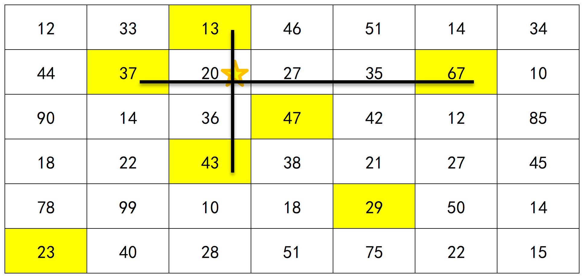
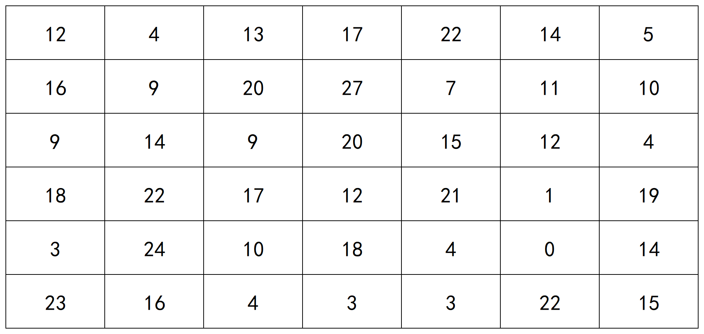
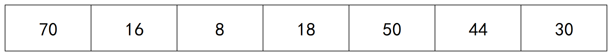

# Special-五一思维训练暨喜迎北航70**周年校庆特别赛**

# `A` 仰望星空

时间限制：1000ms  内存限制：65536kb

通过率：265/268 `(98.88%) `  正确率：265/275 `(96.36%)`

## 题目描述

柏彦故地，巍巍学府。春秋代序，峥嵘航路。2022年10月25日，北京航空航天大学将迎来建校70周年华诞。七十载空天报国，新时代逐梦一流，新时代的北航人，将以70周年校庆为契机，总结辉煌成就，展现时代风采；弘扬北航精神，开创美好未来。

[请输出北航校歌《仰望星空》。](http://www.buaa.edu.cn/bhgk/jrbh/bhxg.htm)

## 输入

无

## 输出

```
我仰望星空
它是那样辽阔而深邃
那无穷的真理
让我苦苦地求索 追随
我仰望星空
它是那样庄严而圣洁
那凛然的正义
让我充满热爱 感到敬畏
我仰望星空
它是那样自由而宁静
那博大的胸怀
让我的心灵栖息 依偎
我仰望星空
它是那样壮丽而光辉
那永恒的炽热
让我心中燃起希望的烈焰
响起春雷
那永恒的炽热
让我心中燃起希望的烈焰
响起春雷
```

# `B` 切切切

时间限制：1000ms  内存限制：65536kb

通过率：149/152 `(98.03%) `  正确率：149/169 `(88.17%)`

## 题目描述

在平面直角坐标系上，有一个顶点分别在 $(x_0,y_0),(x_0+a,y_0),(x_0,y_0+b)$ 三点上的三角形 $A$ ；

请给出一条平行于 $y$ 轴的直线 $ L:x=c$ ，使得三角形 $A$ 被直线分成面积相等的两半；

正式地讲：请给出一个实数 $c$ ，使得三角形 $A$ 中，横坐标小于或等于 $c$ 的点所组成图形的面积 $ S_{Left}$ ，与横坐标大于 $c$ 的点所组成图形的面积 $S_{Right}$ 相等。

## 输入格式

输入为一行，四个整数 $x_0,y_0,a,b$ （$-1,000\leq x_0,y_0\leq 1,000,\ 1\leq a,b\leq 1,000$）

含义见题目描述

## 输出格式

一个实数 $c$ ，需满足 $x_0\leq c\leq x_0+a$ ，表示一条直线 $L:x=c$ ，可将三角形 $A$ 分成面积相等的两半。

输出结果保留 $5$ 位小数

## 输入样例1

```
0 0 1 1
```

## 输出样例1

```
0.29289
```

## 输入样例2

```
347 -685 868 194
```

## 输出样例2

```
601.23131
```

### 图示


### 解的正确性判断

本题采用 `Special Judge`。

假设你给出的答案为 cc ，标准答案为 dd ，那么只有满足 |c−d|max(1,|d|)≤10−5|c−d|max(1,|d|)≤10−5 时，你的答案才会被认为是正确的。如果你不太理解这里在说什么，那么你只需要按照题目的要求将结果保留 55 位小数即可。

如果你wa了但过了大部分测试点，试着多输出几位小数。

## 思路

结合简单的几何计算即可得出结果；
由相似三角形面积与边长的关系可以得到${x_0+a-c \over a}=\sqrt{1\over 2}$，解得$c=x_0+a-\sqrt{{1}\over {2}}\times a$

# `C` 数0！

时间限制：1000ms  内存限制：65536kb

通过率：115/161 `(71.43%) `  正确率：115/491 `(23.42%)`

## 题目描述

计算 $n!$ 末尾0的个数

## 输入

一行一个数 $n$

## 输出

输出一个数，代表 $n!$ 末尾 $0$ 的个数

## 输入样例

```
10
```

## 输出样例

```
2
```

## 数据范围

$1\le n \le 10^{18}$

## Hint

$10!=3628800$

*Author: lxy*

## 思路

拆末尾0其实就是看质因数2的个数和质因数5的个数有多少，显然后者更少，所以求质因数5的个数即可。

# `D` 七巧板入门

时间限制：1000ms  内存限制：65536kb

通过率：80/104 `(76.92%) `  正确率：80/231 `(34.63%)`

## 题目描述

开花学长想玩七巧板，但是他的手太笨了，所以只能从最基础的玩起（大概也就是两三岁的水平吧）。

现在他的手上有 $n$ 个大小一样的等腰直角三角形，如下图所示


他现在希望能够使用这 $n$ 个等腰直角三角形的板子，拼成一个**正方形**。具体规则如下：

- 所有的板子可以以任意角度旋转，或者移动他所在的位置
- 所有的板子**不可以重叠或者被覆盖**，只可以相邻地进行拼接。
- 拼成的正方形**内部不可以存在空出来的区域**，即必须拼成一个实心的正方形
- $n$ 个板子必须**全部用上才行**

开花学长希望你帮他看看，用 $n$ 个等腰直角三角形板子能否按照上述规则拼成正方形。

## 输入

本题的每一个测试点均为多组输入

第一个数为数据组数 $t(1\le t\le 10000)$

接下来 $t$ 行，每行 $1$ 个整数 $n(1≤n≤10^9)$，表示拥有的等腰直角三角形板子的个数。

## 输出

对于每组数据，输出一行，如果可以按照上述规则拼成正方形，则输出一行`"YES"`，不可以则输出`"NO"`。（两者均不需要输出双引号）

## 输入样例

```
6
1
2
3
4
5
6
```

## 输出样例

```
NO
YES
NO
YES
NO
NO
```

## 样例解释

$n=2$ 的时候可以拼成这个样子：


$n=4$ 的时候可以拼成这个样子：


不难看出，剩下的几组情况无论如何都拼不出想要的正方形。

**顺便，如果觉得自己推的没问题但是不知道哪里错了的话，可以看看看看，下图这个是不是正方形呢？**


## 思路

不难分析，最小的两种正方形是由两个直角三角形或者四个直角三角形拼成的。同时，由于这两个正方形的较大者边长是较小者边长的根号2倍，所以这两种正方形不可以互相混搭拼接，只能在他们各自的基础上组成更大的正方形。

那么答案就显而易见了，只有当三角形的个数为 $2\times x \times x$ 或者 $4\times x \times x$ ($x$ 为正整数)的情况下，才能拼成三角形，其他时候均不可以。

# `E` 高精度阶乘

时间限制：1000ms  内存限制：65536kb

通过率：39/51 `(76.47%) `  正确率：39/134 `(29.10%)`

## 题目描述

阶乘是一个增长非常快的表达式，对于一个整数 $n$，请求出 $n!$ 的总位数和最小非零位的值。

## 输入

多组数据输入

每组数据，一个整数 $n$

## 输出

每组数据输出一行，两个整数，用空格隔开，分别代表 $n!$ 的位数和最小非零位的值。

## 输入样例

```
7
1
```

## 输出样例

```
4 4
1 1
```

## 样例说明

$7!=5040$，共有`4`位，最小非零位为第二位，其值为`4`

## 数据范围

$0≤n≤5000$

特别的，$5000!$ 的总位数不超过$17000$

## HINT

不用高精度，这是个数学题

## 思路

位数用斯特林逼近公式即可，最后非零位直接把2和5拆开，剩下的乘起来就行，但是这里给一个对 $n\le 10^{100}$ 有效的做法。

# `F` 排队打饭

时间限制：1000ms  内存限制：65536kb

通过率：43/48 `(89.58%) `  正确率：43/75 `(57.33%)`

## 题目描述

在沙河西区的食堂里，有  $n$ 个人在同一个窗口排队打饭，假如每个人打饭的时间为 $t_i$，请编程找出  $n$ 个人排队的顺序，使  $n$ 个人的平均等待时间最小。

## 输入格式

共两行

第一行为一个正整数，表示排队人数 $n$

第二行为  $n$ 个整数，第  $i$ 个整数表示第i个人打饭时间 $t_i$

## 输出格式

共两行

第一行为n个整数，表示平均等待时间最短的排队顺序（按输入时的人员编号表示，若两个人的打饭时间$t_i$相同，优先输出靠前的编号）

第二行为一个浮点数，表示这种方案下的平均等待时间（保留两位小数）

## 输入样例

```
10 
56 12 1 99 1000 234 33 55 99 812
```

## 输出样例

```
3 2 7 8 1 4 9 6 10 5
291.90
```

## 数据范围与约定

$0<n<1000，0≤t_i<10^6$

## 思路

按照等待时间从小到大排序即为最优解。

# `G` 作业规划

时间限制：1000ms  内存限制：65536kb

通过率：12/15 `(80.00%) `  正确率：12/36 `(33.33%)`

## 题目描述

lxy 这个学期非常的忙碌，他需要在规定时间内完成一些作业。但由于精力有限，他不一定能完成所有作业，所以想请你写一个程序判断他最多能完成多少项作业。

具体的：

一共有 n 项作业，第 i 项作业发布于第 li 天，截至于第 ri 天。这意味着 lxy 只能在时间段 [li,ri] 完成作业 i。

lxy 为保证充足的睡眠，每天最多完成一项作业。

求一共 m 天内，lxy 最多完成几项作业。

## 输入格式

第一行两个整数 n,m 表示共 n 项作业，共 m天

接下来 n 行，每行两个整数 li，ri 表示第 i 项作业的开始截至日期

## 输出格式

一个整数，代表最多能完成作业的项数

## 输入样例

```
5 5
2 4
2 3
3 4
4 4
1 5
```

## 输出样例

```
4
```

## 样例解释

第一天完成作业5

第二天完成作业1

第三天完成作业2

第四天完成作业3

第五天开摆

## 数据范围

1≤n,m≤1000

1≤li≤ri≤m

## HINT

如果没有看到网络流，那我不能认可这一届竞赛选手的含金量

*Author: lxy*

## 思路

给出一个比较显然的贪心：在生活当中，大家每一天会选择做哪一项作业？一定是布置了的并且截至时间最早的。根据生活常识这样一定是最优的。所以我们枚举每一天$t$，在所有作业中找到一个没有做过且$l_i\leq t\leq ri$且$r_i$最小的，将他完成。统计答案。

另外可以根据HINT所说使用网络流来解决该问题。设置超级源点和汇点，将图设为二分图，每次从超级源点连单向边向对应的作业，流量为需要完成该作业的天数（1天），再将每个作业和所有可以做的日期都连上流量为1的单向边，然后所有日期向超级汇点连一个单向边，流量分别为1。最终所求的最大流即为最终解。

# `H` 整除求和

时间限制：1000ms  内存限制：65536kb

通过率：22/27 `(81.48%) `  正确率：22/53 `(41.51%)`

## 题目描述

对于给定的 $n$ ，求 $f(n)=\sum_{i=1}^{n}\lfloor \frac{n}{i} \rfloor$ 的值，其中$⌊x⌋$ 表示对 $x$ 向下取整。

## 输入格式

一个正整数 $n$

## 输出格式

一个正整数 $f(n)$

## 输入样例

```
10
```

## 输出样例

```
27
```

## 数据范围

$1\le n \le 10^{14}$

显然f(n)f(n)在`long long`范围内

## HINT

对于给定的n，值不相同的 $\lfloor \frac{n}{i} \rfloor$ 不超过 $2\sqrt n$ 个

*Author: lxy*

## 思路

经典的整除分块问题，如HINT所说，可以判断出 $\lfloor \frac{n}{i} \rfloor$ 相同的 $i$ 到底有多少个，然后就可以得到结果了。

然而利用公式 $f(n)=2\times \sum_{i=1}^{\lfloor \sqrt n\rfloor}\lfloor \frac{n}{i} \rfloor - (\lfloor \sqrt n\rfloor)^2$ 则可以在更快的时间内得到结果。

# `I` 找零！

时间限制：1000ms  内存限制：65536kb

通过率：18/26 `(69.23%) `  正确率：18/57 `(31.58%)`

## 题目描述

给出一个长度为 $n $，初始值全为 $0$ 的序列 。

进行 $m $ 次操作，每次操作给出两个整数 $l$，$r$，把区间 $[l,r]$ 上的值更改为 $1$

求最后得到的序列中**有多少个位置是 $0$**

## 输入格式

第一行两个正整数 $n$，$m$

接下来 $m$ 行，每行两个整数 $l$，$r$，表示修改区间 $[l,r]$

## 输出格式

一个正整数，表示最后序列中 $0$ 的个数

## 输入样例

```
10 4
1 2
5 7
4 8
10 10
```

## 输出样例

```
2
```

## 数据范围

$1≤n≤1×10^7$

$1≤m≤3×10^6$

$1≤l≤r≤n$

## HINT

样例解释：

第一次修改后：1 1 0 0 0 0 0 0 0 0

第二次修改后：1 1 0 0 1 1 1 0 0 0

第三次修改后：1 1 0 1 1 1 1 1 0 0

第四次修改后：1 1 0 1 1 1 1 1 0 1

最后剩下两个0，故输出2

*Author: lxy*

## 思路

利用差分思路，最后再做区间统计即可

# `J` cxccxc与Nim游戏

时间限制：1000ms  内存限制：65536kb

通过率：11/17 `(64.71%) `  正确率：11/53 `(20.75%)`

## 题目介绍

cxccxc和他的好朋友EZIOPQR玩取硬币的游戏。规则如下：

三枚硬币分别摆在一行方格中的某些位置，两人轮流操作。每次从下面两种操作中选择一种。

1. 拿走最左边方格中的硬币（仅当最左边方格有硬币时才可以选择此操作）
2. 玩家选择一枚硬币，将其向左移动一格或多格。移动时不允许跨越其左侧的硬币或与其重叠，也不允许移动出界

轮到某位玩家时，他必须选择一种操作。将最后一枚硬币取走的玩家获胜。

cxccxc先手操作，面对聪明过人的EZIOPQR，他对似乎对取胜毫无信心。请聪明的你编写程序告诉cxccxc在当前局面下他是否是必胜的。

## 输入格式

一行三个整数 $x_1,x_2,x_3$，表示三枚硬币的初始位置

如果这个局面下cxccxc必胜，则输出 `W1N`，否则输出 `L0SE`

## 输入样例1

```
1 2 3
```

## 输出样例1

```
L0SE
```

## 输入样例2

```
3 114514 1919810
```

## 输出样例2

```
W1N
```

## 样例解释

第一个样例中所有可能的游戏过程如下


## 数据范围

$1≤x_1<x_2<x_3<109$

## HINT

再强大的对手也有可能不堪一击.

*AUTHOR:cxccxc*

## 思路

结论是 $x_1+x_2=x_3 时必输，其他时候必赢。具体思路直接摘自gitee仓库链接。

读完题后我们观察到，一个局面对当前操作者来说是必胜的，当且仅当**存在一个操作使得下个局面对于对方来说是必败的**。而当且仅当**所有可能的下一局面对于对方来说都是必胜的**，这个局面对当前操作者来说才是必败的。

因此我们可以从最后的状态开始倒推。

这时只剩下一枚硬币，通过简单的推理，我们可以得出

1. 这枚硬币在最左边的方格（即方格1）时，当前操作者直接拿走这枚硬币，获胜。这个局面对当前操作者来说是必胜的
2. 这枚硬币在方格2时，操作者只能将其向左移到方格1，让对方变成情况1的操作者，对方必胜，即当前操作者必败。
3. 这枚硬币在其他位置时，操作者可以将其移动到方格2，造成一个必败局面，从而使自己必胜

这个结论可以由下面的表格概括

| $x_3$ | 1    | 2    | 3    | 4    | 5    | 6    | 7    | ...  |
| ----- | ---- | ---- | ---- | ---- | ---- | ---- | ---- | ---- |
|       | W1N  | L0SE | W1N  | W1N  | W1N  | W1N  | W1N  | ...  |

现在我们增加一枚硬币。此时，我们发现只有在左边的硬币位于方格1，且操作者将其拿走，才能转换为我们已知的一枚硬币时的状态。因此我们从此状态出发。

对于左边的硬币位于方格1，右边硬币位于方格2时，操作者可以选择拿走左边的硬币将局势变为只有一枚硬币在方格2的必败局面。因此当前为必胜局面，如下表所示。

| $x_2,x_3$ | 1    | 2    | 3    | 4    | 5    | 6    | 7    | ...  |
| --------- | ---- | ---- | ---- | ---- | ---- | ---- | ---- | ---- |
| 1         | \    | W1N  |      |      |      |      |      | ...  |

第i行j列表示左边硬币在方格i，右边硬币在方格j

如果右边硬币在方格3，根据规则，当前操作者只能选择拿走左边硬币或左移右边硬币，无论如何都只能导致对方的必胜局面，因此(1,3)的状态为必败。

| $x_2,x_3$ | 1    | 2    | 3    | 4    | 5    | 6    | 7    | ...  |
| --------- | ---- | ---- | ---- | ---- | ---- | ---- | ---- | ---- |
| 1         | \    | W1N  | L0SE |      |      |      |      | ...  |

通过和之前相似的推理，推出剩下的输赢状态:

| $x_2,x_3$ | 1    | 2    | 3    | 4    | 5    | 6    | 7    | ...  |
| --------- | ---- | ---- | ---- | ---- | ---- | ---- | ---- | ---- |
| 1         | \    | W1N  | L0SE | W1N  | W1N  | W1N  | W1N  | ...  |

如果左边的硬币不在方格1，那么当前操作者只能选择左移左边或右边硬币中的一枚，即**下一个局面为表格中向上或向左可以到达的任意一个合法位置**，因此，我们可以归纳地推出整张表格，每一格对应一种两枚硬币时的局面状态:

| $x_2,x_3$ | 1    | 2    | 3    | 4    | 5    | 6    | 7    | ...  |
| --------- | ---- | ---- | ---- | ---- | ---- | ---- | ---- | ---- |
| 1         | \    | W1N  | L0SE | W1N  | W1N  | W1N  | W1N  | ...  |
| 2         | \    | \    | W1N  | L0SE | W1N  | W1N  | W1N  | ...  |
| 3         | \    | \    | \    | W1N  | L0SE | W1N  | W1N  | ...  |
| 4         | \    | \    | \    | \    | W1N  | L0SE | W1N  | ...  |
| 5         | \    | \    | \    | \    | \    | W1N  | L0SE | ...  |
| 6         | \    | \    | \    | \    | \    | \    | W1N  | ...  |
| 7         | \    | \    | \    | \    | \    | \    | \    | ...  |
| ...       | \    | \    | \    | \    | \    | \    | \    | ...  |

我们加入最后一枚硬币。此时的边界情况是$x_1=1,x_2=2,x_3=3$，操作者只能拿走最左侧的硬币，局面转换为上表的(2,3)，为必胜局面，因此$x_1=1,x_2=2,x_3=3$是必败局面。

| $x_1=1,x_2,x_3$ | 1    | 2    | 3    | 4    | 5    | 6    | 7    | ...  |
| --------------- | ---- | ---- | ---- | ---- | ---- | ---- | ---- | ---- |
| 1               | \    | \    | \    | \    | \    | \    | \    | ...  |
| 2               | \    | \    | L0SE |      |      |      |      | ...  |
| 3               | \    | \    | \    |      |      |      |      | ...  |
| 4               | \    | \    | \    | \    |      |      |      | ...  |
| 5               | \    | \    | \    | \    | \    |      |      | ...  |
| 6               | \    | \    | \    | \    | \    | \    |      | ...  |
| 7               | \    | \    | \    | \    | \    | \    | \    | ...  |
| ...             | \    | \    | \    | \    | \    | \    | \    | ...  |

而$x_1=1$时的其他局面也同样可以到达其上方、左方的局面状态。除此之外，还可以到达只有两枚硬币的局面状态表格中正对的位置。由此我们推得整个表格：

| $x_1=1,x_2,x_3$ | 1    | 2    | 3    | 4    | 5    | 6    | 7    | ...  |
| --------------- | ---- | ---- | ---- | ---- | ---- | ---- | ---- | ---- |
| 1               | \    | \    | \    | \    | \    | \    | \    | ...  |
| 2               | \    | \    | L0SE | W1N  | W1N  | W1N  | W1N  | ...  |
| 3               | \    | \    | \    | L0SE | W1N  | W1N  | W1N  | ...  |
| 4               | \    | \    | \    | \    | L0SE | W1N  | W1N  | ...  |
| 5               | \    | \    | \    | \    | \    | L0SE | W1N  | ...  |
| 6               | \    | \    | \    | \    | \    | \    | L0SE | ...  |
| 7               | \    | \    | \    | \    | \    | \    | \    | ...  |
| ...             | \    | \    | \    | \    | \    | \    | \    | ...  |

同理，$x_1=n$时表格中任意位置对应的局面，其下一个局面可以是向上、向右、向$x_1=1,2,...,n-1$表格的正对位置所对应的局面，分别代表左移三枚硬币中的一枚。继续推导可得：

| $x_1=2,x_2,x_3$ | 1    | 2    | 3    | 4    | 5    | 6    | 7    | ...  |
| --------------- | ---- | ---- | ---- | ---- | ---- | ---- | ---- | ---- |
| 1               | \    | \    | \    | \    | \    | \    | \    | ...  |
| 2               | \    | \    | \    | \    | \    | \    | \    | ...  |
| 3               | \    | \    | \    | W1N  | L0SE | W1N  | W1N  | ...  |
| 4               | \    | \    | \    | \    | W1N  | L0SE | W1N  | ...  |
| 5               | \    | \    | \    | \    | \    | W1N  | L0SE | ...  |
| 6               | \    | \    | \    | \    | \    | \    | W1N  | ...  |
| 7               | \    | \    | \    | \    | \    | \    | \    | ...  |
| ...             | \    | \    | \    | \    | \    | \    | \    | ...  |

| $x_1=3,x_2,x_3$ | 1    | 2    | 3    | 4    | 5    | 6    | 7    | ...  |
| --------------- | ---- | ---- | ---- | ---- | ---- | ---- | ---- | ---- |
| 1               | \    | \    | \    | \    | \    | \    | \    | ...  |
| 2               | \    | \    | \    | \    | \    | \    | \    | ...  |
| 3               | \    | \    | \    | \    | \    | \    | \    | ...  |
| 4               | \    | \    | \    | \    | W1N  | W1N  | L0SE | ...  |
| 5               | \    | \    | \    | \    | \    | W1N  | W1N  | ...  |
| 6               | \    | \    | \    | \    | \    | \    | W1N  | ...  |
| 7               | \    | \    | \    | \    | \    | \    | \    | ...  |
| ...             | \    | \    | \    | \    | \    | \    | \    | ...  |

$......$

通过归纳法不难得出，当$x_1=n$时，只有$x_3-x_2=n$这条线上的局面为必败，其他情况全为必胜局面。

因此我们只需判断$x_1+x_2=x_3$是否成立即可，成立即为必败，否则为必胜。

# `K` a+b problem2.79603

时间限制：1000ms  内存限制：65536kb

通过率：46/49 `(93.88%) `  正确率：46/69 `(66.67%)`

## 题目描述

lxy的计算器加减乘除号全坏了，但是他想计算 $a+b$ 的值，你能帮帮他吗？

## 输入

两个非负整数 $a, b$ ，且 $0≤a, b, a+b≤2147483647$

## 输出

一个非负整数，表示 $a+b$ 的值

## 输入样例

```
1 2
```

## 输出样例

```
3
```

## Hint

本题采用Special Judge，你的程序里不能出现+、-、*、/，试试位运算吧

注意去掉所有 `//` 注释

*Author：lxy*

## 思路

加法的关系为 $a+b=(a\oplus b)+((a\&b)<<1)$

由此即可使用位运算来完成了，再把这个递归转成迭代。

# `L` a*b problem2.79603

时间限制：1000ms  内存限制：65536kb

通过率：31/40 `(77.50%) `  正确率：31/78 `(39.74%)`

## 题目描述

lxy的计算器加减乘除号全坏了，但是他想计算$a∗b$的值，你能帮帮他吗？

## 输入

两个非负整数 $a,b$ ，且 $a,b,a∗b$ 在 `long long `的范围以内，

## 输出

一个非负整数，表示 $a∗b$ 的值

## 输入样例

```
2 3
```

## 输出样例

```
6
```

## Hint

本题采用Special Judge，你的程序里不能出现+、-、*、/，试试位运算吧

注意去掉所有 `//` 注释

*Author：lxy*

## 思路

在上一题的做法加上龟速乘，也就是快速幂的乘法改成加法形式。

# `M` a^b problem2.79603

时间限制：1000ms  内存限制：65536kb

通过率：19/27 `(70.37%) `  正确率：19/59 `(32.20%)`

## 题目描述

lxy的计算器加减乘除号全坏了，但是他想计算 $a^b$ 的值，你能帮帮他吗？

## 输入

两个正整数 $a,b$ ，且 $a,b≤2147483647$

## 输出

一个正整数，表示 $a^b$对 $2^{64}$ 取模的值

## 输入样例

```
2 3
```

## 输出样例

```
8
```

## Hint

本题采用Special Judge，你的程序里不能出现+、-、*、/，试试位运算吧

注意去掉所有 `//` 注释

使用 `unsigned long long `在溢出时相当于对于 $2^{64}$ 取模

*Author：lxy*

## 思路

在前两题基础上再加上快速幂即可。

# `N` 最大平均子段

时间限制：1000ms  内存限制：65536kb

通过率：8/15 `(53.33%) `  正确率：8/58 `(13.79%)`

## 题目描述

给出一个长度为$n$的序列$a$，找到一对 $(l,r) $ 且 $l<r$，使得 $\frac{1}{r-l+1}\sum_{i=l}^r a_i$ 最大，求这个最大值

## 输入格式

第一行一个数 $n$，代表序列长度

第二行 $n$ 个数，代表序列 $a$

## 输出格式

一个浮点数，表示最大值，保留四位小数

## 输入样例

```
5
1 5 2 6 2
```

## 输出样例

```
4.3333
```

## 数据范围

$0≤ai≤10^9$

$1<n≤10^5$

## Hint

本来想出一个精妙的二分

*Author: lxy*

## 思路

不难分析这个子段包含的数字个数只可能是2个或者3个

# `O` lxy不疑惑

时间限制：1000ms  内存限制：65536kb

通过率：24/24 `(100.00%) `  正确率：24/35 `(68.57%)`

## 题目描述

lxy手中有两种面值的金币，两种面值均为正整数且彼此互素。每种金币lxy都有无数个。在不找零的情况下，仅凭这两种金币，有些物品他是无法准确支付的。现在lxy想知道考考你：**在无法准确支付的物品中，最贵的价值是多少金币？**

## 输入格式

两个正整数 $a$ 和 $b$，它们之间用一个空格隔开，表示lxy中金币的面值。

## 输出格式

一个正整数 $N$，表示不找零的情况下，lxy用手中的金币不能准确支付的最贵的物品的价值。

## 输入样例

```
3 7
```

## 输出样例

```
11
```

## 数据范围

$2≤a，b≤1×10^9$

## HINT

那一年AC的第一道题目

谨以此怀念那些沉醉在计算机前的日日夜夜

Author: lxy

## 思路

经典又简单的数学问题，答案是 $a\times b - a - b$

# `P` 自习安排

时间限制：1000ms  内存限制：65536kb

通过率：9/16 `(56.25%) `  正确率：9/50 `(18.00%)`

## 题目描述

lxy下定决心从明天开始自习，但每天早起对他是一个巨大的考验，所以他制定了一个自习计划。

首先规定一个基准x

第ii天时，设前 $i−1$ 天已经自习了 $t$ 天，如果 $\frac{t}{i-1}\leq x$，那么这一天lxy选择去自习，否则他会在寝室里摸鱼

特别的，第一天是计划的开始，所以lxy一定会去自习。

求n天里，lxy自习了多少天。

## 输入格式

多组数据输入

每行三个正整数 $n,a,b$，其中$x=\frac{a}{b}$

## 输出格式

每组数据输出一个正整数，表示自习的天数

## 输入样例

```
4 0 1
8 7 10
4 1 1
```

## 输出样例

```
1
5
4
```

## 样例解释

第一组数据，$x=0$，所以除了第一天lxylxy都在摸鱼

第二组数据，$x=0.7$，第1、3、4、6、7天在自习

第三组数据，$x=1$，所以一直在自习

## 数据范围

$0≤n,a,b≤1×10^9$

$b≠0,a≤b$

数据不超过$10^5$组

*Author: lxy*

## 思路

结论：$ans=(n-1)*a/b+1$

假设答案是$ans$。那么一定存在第$k_1$天自习天数从$ans-1$变成$ans$。则需要满足存在$k_1$，使得$\frac{ans-1}{k_1-1}\leq x$，

并且不存在第$k_2$天，使自习天数从$ans$变成$ans+1$。则需要满足任意$k_2$，使得$\frac{ans}{k_2-1}> x$

根据$k$的范围，恒等变换可得$(n-1)x\leq ans <(n-1)x+1$。发现ans只能取到一个整数，即$(n-1)*a/b+1$。

# `Q` 异或求和

时间限制：1000ms  内存限制：65536kb

通过率：8/13 `(61.54%) `  正确率：8/19 `(42.11%)`

## 题目描述

求$f(x)=\sum_{i=l}^rm⊕i$

## 输入

多组数据，第一行一个正整数$T$

接下来$T$行，每行三个整数 $l,r,m$

## 输出

一共 TT 行，每行一个整数，代表 $f(x)$

## 输入样例

```
2
3 6 1
100 1000000000 987654321
```

## 输出样例

```
18
569568287222420635
```

## 数据范围

$0≤l≤r≤10^9,1≤m≤10^9$

$1≤T≤10^3$

*Author: lxy*

## 思路

直接搬运自gitee仓库。

$l=0,r=2^{k}-1,m\leq r$

此时的答案是$\sum_{i=0}^ri$，因为异或的值一定可以把所有数不重复地取完

当$l=0,r=2^{k}-1$

此时的答案是 $\lfloor \frac{m}{r+1}\rfloor *(r+1)+\sum_{i=0}^ri$，也就是说$m$低位部分统计如上，超出$r$的高位部分统计了$r+1$次

当$l=t*2^k,r=t*2^k+2^{k}-1$

此时的答案是 $(\lfloor \frac{m}{2^k}\rfloor\oplus l) *(r-l+1)+\sum_{i=0}^{2^k}i$，也就是超出$2^{k}-1$的高位部分还要和$r$的高位部分异或再统计。

当$l=0$时，$[l,r]$可以分成若干个$[l_i,r_i](l=t_i*2^i,r=t_i*2^i+2^{i}-1)$，将$[l,r]$全部覆盖。也就是把区间拆分按上述方法计算。

当$l\ne 0$时，答案为$[0,r]-[0,l-1]$

本仓库给了一个求 $\sum_{i=a}^b\sum_{j=c}^di\oplus j$ 的做法，基本是类似的，统计两个去年内不同数位中 $1$ 的总数和 $0$ 的总数，再利用乘法原理进行计数。

# `R` 因数求和

时间限制：1000ms  内存限制：65536kb

通过率：9/15 `(60.00%) `  正确率：9/41 `(21.95%)`

## 题目描述

设 $f(x)$ 表示 $x$ 所有因子的和，例如 $f(6)=1+2+3+6=12$

给出一个长度为 $n$ 的序列 ${a_1,a_2,…,a_n}$，求 $\sum_{i=1}^n f(a_i)$

## 输入格式

第一行一个正整数 $n$

第二行 $n$ 个正整数表示序列 $a_i$

## 输出格式

一个正整数表示答案

## 输入样例

```
5
1 3 2 4 5
```

## 输出样例

```
21
```

## 数据范围

$1≤n≤1×10^6$

$1≤ai≤1×10^6$

## HINT

可能会用到的计算时间复杂度的方法：

$a_n=\frac{1}{1}+\frac{1}{2}+\frac{1}{3}+...+\frac{1}{n}-ln(n)$

$a_n$ 是收敛数列

具体证明参见工科数学分析

*Author: lxy*

## 思路

答案是$x*\sum_{i=1}^{n/x} a_{i*x}$，每个$x$需要循环$\frac{n}{x}$次，所以一共循环次数是$\sum_{x=1}^n \frac{n}{x}$，这个级数和$n\log n$等价

然而这玩意儿就是个dirichlet前缀和，所以可以先把质数筛出来，将复杂度优化到 $O(n\log \log n)$

# `S` 时间与空间

时间限制：1000ms  内存限制：65536kb

通过率：7/7 `(100.00%) `  正确率：7/9 `(77.78%)`

## 题目描述

*引言：古有二尊并存，其一看时光流转，其一看地阔天宽。为求未来之后的未来，欲探天地尽头的天地。二尊各行其道，与神奥大尊相随常伴。——《古老诗文1》*

呱呱泡蛙想要去古神奥。它打开阿尔宙斯手机，收到有关时空旅行的信息：

**主定理（Master Theorem）**是算法分析的第一个定理，用于研究分治类问题的时间复杂度和空间复杂度。这个定理的名字叫“主定理”，听起来很古怪。

假设一个规模为 $n$ 的大问题 $T(n)$ 可以拆成 $a$ 个规模为 $\frac{n}{b}$ 的小问题，外加一个只和 $n$ 相关的函数项问题 $f(n)$ ，$a≥1$ 和 $b>1$ 都是常数，形如这个表达式： $T(n)=aT(\frac{n}{b})+f(n)$

此时就可以根据函数项问题 $f(n)$ 的阶来估计大问题 $T(n)$ 的阶数。

描述函数的阶，使用大写Theta符号，即 $Θ(f(n))$ 。

**情形1**：如果 $f(n)$ 的阶很小。对照的参照物是幂函数 $n^{\log_b a}$ 。如果有：$\Theta(f(n))<n^{\log_b a}$，函数 $f(n)$ 比这个幂函数严格小，此时函数 $f(n)$ 这项可以直接省略不计。此时问题 $T(n)$ 的复杂度：$\Theta(T(n))=n^{\log_b a}$

问题 $T(n)$ 的复杂度直接就是该幂函数。

**情形2**：如果$f(n)$ 的阶中等。对照的参照物是幂函数 $n^{\log_b a}$ 乘上若干个对数函数 $\log ⁡n$ ，这个“若干个”可以为零个。如果有：$\Theta(f(n))=n^{\log_b a}\log^k n\quad k\ge 0$,此时问题 $T(n)$ 的复杂度：$\Theta(T(n))=n^{\log_b a}\log^{k+1} n$ 会比之前的对数个数增加一个。

**情形3**：如果 $f(n)$ 的阶很大。此时函数 $f(n)$ 必须要打破上述表达式的限制。不仅要有：$\Theta(f(n))>n^{\log_b a}$

还要对于某个常数 $c>1$ 和所有充分大的 $n$ 有：$cf(n)\ge af(\frac{n}{b})$

此时函数 $T(n)$ 会受到函数 $f(n)$ 的连累，也脱离表达式的限制，有：$\Theta(T(n))=\Theta(f(n))$

鉴于本题中可能出现的阶一律写成如下形式：

```
n^xlog^y(n)，x和y为非负的整数或小数，例如n^2log^0(n) 
```

对于算法而言，超出多项式的复杂度（诸如指数和阶乘）是实际应用不会涉足的领域，因此在此处不考虑。本题也不会出现其他复杂的函数，所以情形3的条件，直接判断是否高阶即可。

## 输入

多行输入，每行的结构是：小数 $a≥1$ 、空格、小数 $b>1$ 、空格、函数 $f(n)$ 的阶。

输入的函数 $f(n)$ 的阶是两个非负浮点数 $x$ 和 $y$ ，表示 $n^x\log^y(n)$。

## 输出

对于每行数据，输出一行，为函数T的阶。

输出格式为`n^xlog^y(n)`，两个非负浮点数 x 和 y 保留3位小数。

输出数据的某部分如果为0或1，则简化该部分。如果为0则不输出，都为0则输出1。如果为1则输出不带相应上标。

## 输入样例

```
2 2 0 1
```

## 输出样例

```
n
```

## 其他

大O记号和小o记号，是函数的阶的更加规范的描述。在数据结构和算法中的大O记号是“小于等于”的含义，在数学分析中的小o记号是“小于”的含义。它们原本是希腊字母Omicron，由于字形相同，也可以理解为英文字母大O和小o。

英文-micro-和英文-mega-表示10的负六次方（百万分之一）和六次方（百万），也表示“小”和“大”。小和大也是希腊字母Omicron和Omega常表示的含义。

*后记：时间是不停歇的奔流。是过去，是未来，是现在……空间是无止尽的延展。而心灵，亦是空间……——《古老诗文15》*


*Author：买到传说阿尔宙斯的呱呱泡蛙*

## 思路

直接模拟即可，但是要注意c语言中`abs`和`fabs`的区别

# `T` 计算连分数

时间限制：1000ms  内存限制：65536kb

通过率：7/7 `(100.00%) `  正确率：7/15 `(46.67%)`

## 题目介绍

呱呱泡蛙今天来介绍一下连分数算法。

怎样把一个数展开成为连分数？很简单，不停地向下取整，再取倒数就可以了。

比如： $\sqrt{2}=1+\left(-1+\sqrt{2}\right)=1+\frac{1}{1+\sqrt{2}}=1+\frac{1}{2+\left(-1+\sqrt{2}\right)}=1+\frac{1}{2+\frac{1}{1+\sqrt{2}}}$

在这里循环了。于是可以记作：$\sqrt{2}=\left[1,2,2,2,2,2,…\right]$

一般对下标的表述从0开始。这个例子中的连分数第0项是1，第1项是2，以此类推。

直接计算连分数，存在浮点精度问题。比如计算根号7的连分数展开，本来应该拥有一个稳定的循环节。但是如果直接用浮点类型计算，你会见到：

```
2 1 1 1 4 1 1 1 4 1 1 1 4 1 1 1 4 1 1 1 4 1 1 1 4 1 2 684 8 3 15
```

一般不超过40位就会因为浮点精度问题导致计算失败。怎么办？

解决方案是这样的。定义一个有理数结构体：

```
struct rational
{
    long long p,q;
};
```

定义一个特殊的结构体：

```
struct quaderic
{
    struct rational a,b;
};
```

用来表示全体这种特殊类型的数： $a+b\sqrt{d}$

在计算的时候要注意，有理数加减乘除时，经常需要约分，计算一次约分一次。所以，最大公约数的写法也提供好了：

```
long long gcd(long long a,long long b)
{
    if(b==0)
    {
        return a;
    }
    return gcd(b,a%b);
}
```

有了以上工具，请你来计算根号d的连分数展开吧！

## 输入格式

两个数，d和n。其中，d为正整数，并且不是完全平方数，n表示计算到第n位，而下标从0开始。比如n是0的时候，要计算1位，即第0位。

## 输出格式

输出一行，共n+1个数，是d的连分数展开到第n位，每两个数之间有一个空格。

## 输入样例

```
12 16
```

## 输出样例

```
3 2 6 2 6 2 6 2 6 2 6 2 6 2 6 2 6
```

## 样例解释

$\sqrt{12}=3+(-3+\sqrt{12})=3+\frac{1}{\frac{3+\sqrt{12}}{3}}=3+\frac{1}{2+\frac{-3+\sqrt{12}}{3}}=3+\frac{1}{2+\frac{1}{3+\sqrt{12}}}=3+\frac{1}{2+\frac{1}{6+(-3+\sqrt{12})}}$

在这里循环了。于是可以记作： $\sqrt{12}=\left[3,2,6,2,6,2,…\right]$

## 数据范围

d不超过10000，n不超过200。


*Author：呱呱泡蛙*

## 思路

同样是模拟，但是建议写好分数结构体再做模拟，防止码风过于混乱

# `U` 苍穹一粟

时间限制：1000ms  内存限制：65536kb

通过率：7/10 `(70.00%) `  正确率：7/24 `(29.17%)`

## 备注

原题为分成了好几个解谜环节，这里只留下原题面的内容。

这张地图由 $m×n$ 个数字构成，如图所示（该示例中 $m=6,n=7$）：



#### 第一步

地图中的坐标表示法为：左下角为 $(0,0)$，向右为 $x$ 轴（长度为 $n$ ），向上为 $y$ 轴（长度为 $m$）。

在这 $m×n$ 个数字中，有且仅有7个质数。且这7个质数中，有且仅有两个点横坐标相同，有且仅有另外两个点纵坐标相同，这两组点分别连接成横线和竖线，找到这两条线的交汇处的点，该点上的数字与其横，纵坐标之和记为$k$。（此处$20+2+4=26$）

#### 第二步

将整个地图中的数字对第一步中得到的$(k+$纵坐标$−k$的最小非$1$因数)进行取余，得到新的$m×n$表。



#### 第三步

将第二步中得到的 $m×n$ 表，每一列从上往下，依次用较大的数减去较小的数再乘2，得到新数，直到每行得到一个数，规则示例如下（例如第二步图中第一列）：

```
(16 - 12) * 2 = 8
(9 - 8) * 2 = 2
(18 - 2) * 2 = 32
(32 - 3) * 2 = 58
(58 - 23) * 2 = 70
```

因此第一列得到5

从而得到一个长度为 $n$ 的一维序列：



#### 以下是地图破解方法的第四步：

将第三步中得到的一维数字序列中的所有数取异或，得到 $a$，例如`70^16^8^18^50^44^30=76`。将 $a$ 分别 $n,m$ 取余，得到的数在原地图中的坐标，与第一步中数所在位置中点的数即为秘密文件的坐标。（位置向上，向左取整）

在示例中，原地图坐标为 $(6,4)$ 的数为与第一步质数中间为 $35$。

## 输入

第一行输入两个正整数 $m,n$，用空格隔开，分别表示地图的行数和列数。

接下来，$m$ 行，每行 $n$ 个用空格隔开的正整数，表示每一个坐标点中的数字 $a_{ij}$（输入顺序为从上往下，从左往后）。

## 输出

输出一个数，为秘密文件所在坐标点中的数字。

## 输入样例

```
6 7
12 33 13 46 51 14 34
44 37 20 27 35 67 10
90 14 36 47 42 12 85
18 22 43 38 21 27 45
78 99 10 18 29 50 14
23 40 28 51 75 22 15
```

## 输出样例

```
35
```

## 数据范围

- $5<m,n<50$
- $a_{i,j}$ 在`int`范围内

## 思路

模拟，数据很弱，但是这里还是用Pollard-Rho找一个数的最小质因数。